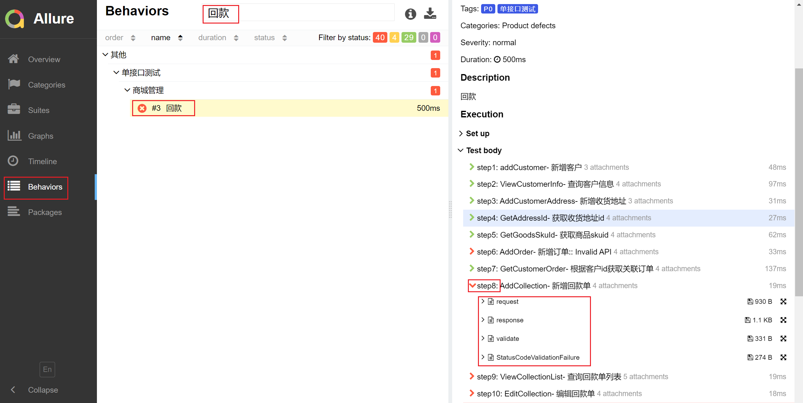

# 历史报告
历史报告列表显示执行历史，统计每次测试结果，并提供link链接到对应测试报告详情、日志详情。

## 结果统计
- 测试步骤
- 测试用例
- 默认为测试步骤，可选择“用例”查看以测试用例为维度的统计结果

## 测试报告

### Log
执行当前测试时的全量日志信息。 

### pytest
pytest-html生成的报告，内容较简洁，颗粒度为 测试用例。_--仅allure报告生成失败时提供_

### allure
allure-pytest生成的报告，内容较丰富，颗粒度为 测试步骤，且包含步骤请求、响应、结果校验、变量提取等详细信息。
allure报告包含比较详细的报告内容：用例、步骤、步骤请求、步骤响应、步骤结果校验、步骤变量提取、统计等。

## 阻塞接口维护
1. 点击阻塞接口数量，弹窗阻塞接口列表详情

2. 点击接口描述，可查看接口所属用例集->用例->步骤

3. 点击Allure打开allure报告页面，-> behaviors: 查询用例名称可查到对应步骤的详细执行信息
