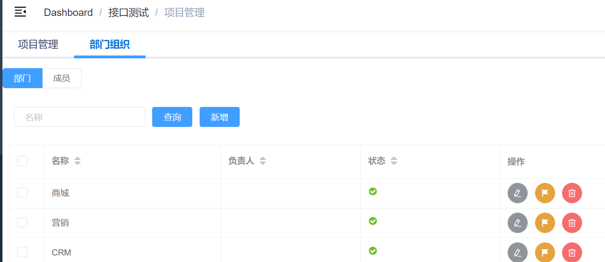
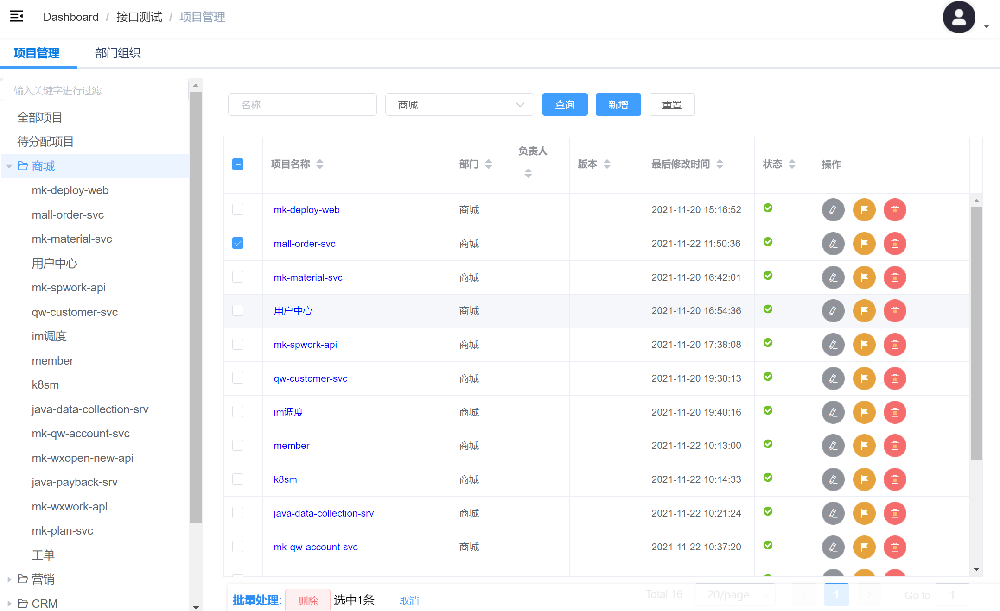
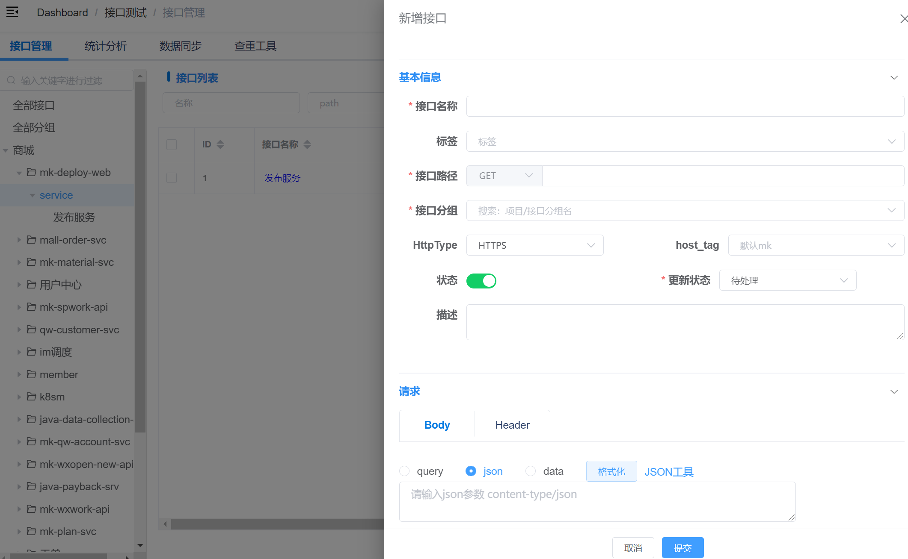
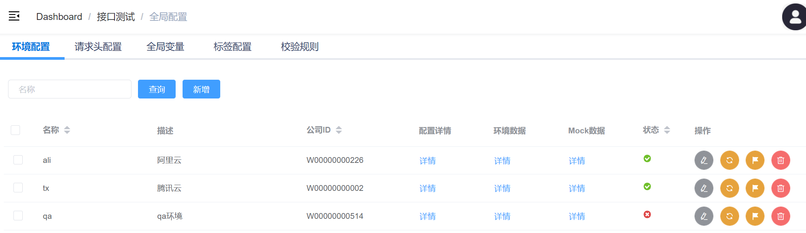
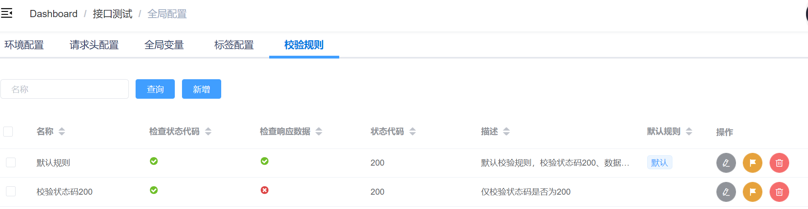
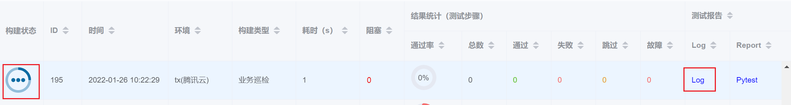
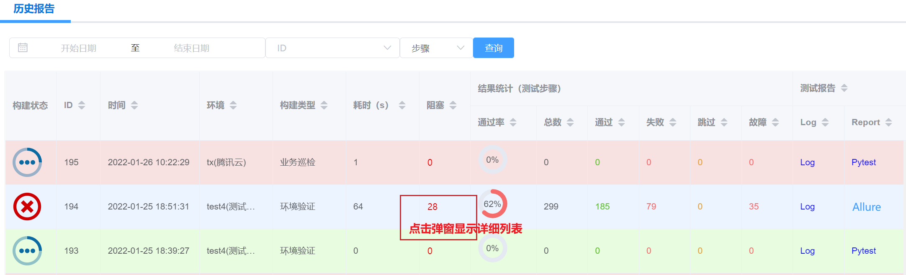
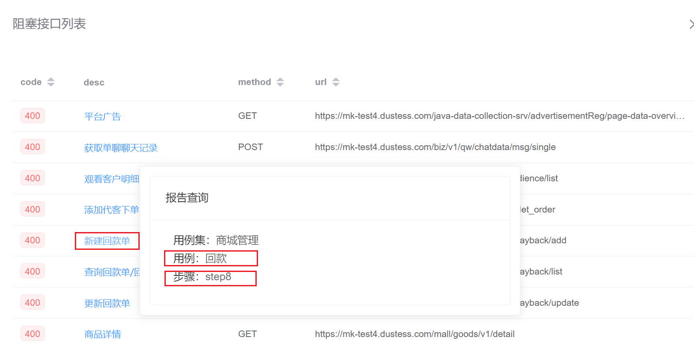
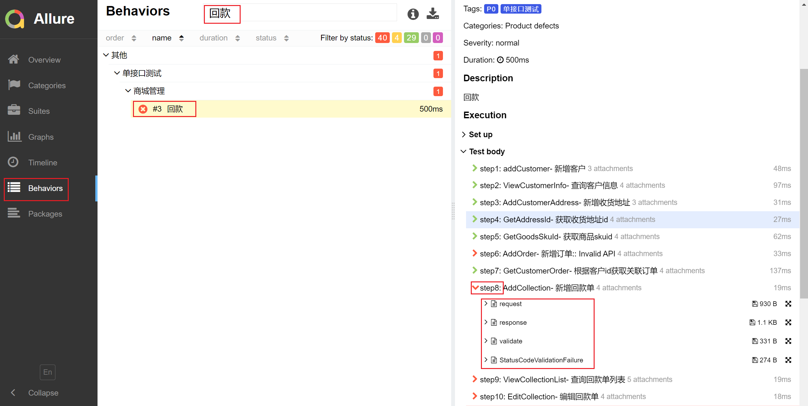

# 开始第一个测试
这里简单介绍快速开始一个测试的基本流程。

## 步骤1：添加接口到测试平台
_如果不需要新增接口，跳过此步骤。_
1. 项目管理->新建项目（如无），指定项目所属部门（如无，创建部门）

2. 接口管理->新建接口，指定接口所属项目、分组（如无，新建）

## 步骤2：新建测试用例
_如果不需要新增用例，跳过此步骤。_
1. 新建测试用例集，需选择所属部门
2. 新建测试用例，需选择所属用例集
3. 新增测试步骤，需选择所属用例，关联接口（可复用接口信息中的用例模板）

## 步骤3：添加测试全局配置
1. 创建环境配置：填写必填项，测试执行时需要选择

2. 创建校验规则：至少1个，测试执行时需要选择

## 步骤4：测试执行
可以多种方式执行测试：
1. 接口测试->工作台
   1. 快速测试 - 查询符合指定条件的用例/集进行执行
   2. 业务巡检/回归测试 - 全量用例执行
   3. 冒烟测试 - 单接口用例（P0） + 场景用例
   4. 环境验证 - 单接口用例（P0:核心接口正向测试）
2. 接口测试->用例管理
   1. 指定用例集/用例/步骤直接执行
   2. 多条用例集/用例/步骤直接执行

## 步骤5：查看测试报告
1. 点击执行后，可立即在 **_历史报告_** 查看实时日志。

2. 执行完毕后，在历史报告页面查看结果报告。
   1. 结果统计：默认维度为测试步骤，可选择“用例”查看以测试用例为维度的统计结果。
   2. 测试报告
      1. pytest：pytest-html生成的报告，内容较简洁，颗粒度为 测试用例。_--仅allure报告生成失败时提供_
      2. allure：allure-pytest生成的报告，内容较丰富，颗粒度为 测试步骤，且包含步骤请求、响应、结果校验、变量提取等详细信息。
      3. Log：执行当前测试时的全量日志信息。
   3. **阻塞接口信息**
      1. 点击阻塞接口数量，弹窗阻塞接口列表详情
      
      2. 点击接口描述，可查看接口所属用例集->用例->步骤
      
      3. 点击Allure打开allure报告页面，-> behaviors: 查询用例名称可查到对应步骤的详细执行信息
      
