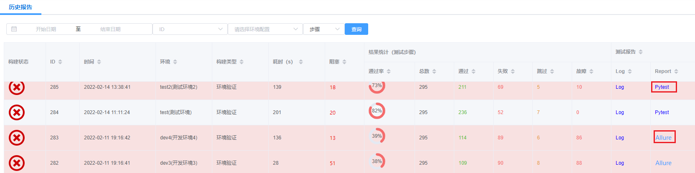
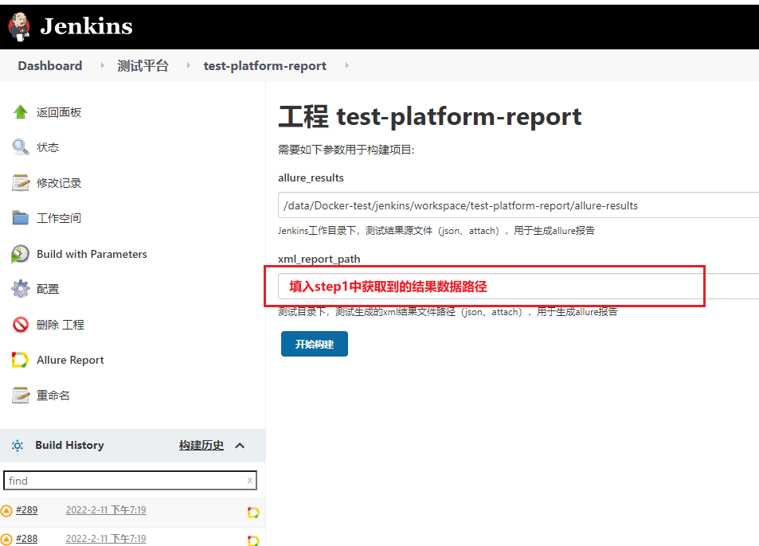

# 常见问题

## 1. 我有一个新环境，如何在平台上快速执行测试？
参考[指南->第一个测试](/api_test/guide/first_test/)
1. 新建测试环境，更新环境数据
2. 新建校验规则（如无）
3. 执行测试
   1. 选择对应测试环境
   2. 选择校验规则（一般默认就好）
4. 查看测试结果

## 2. 如何新增内建方法？
新增内建方法详细见 [开发手册->自定义内建方法](/api_test/develop/new_builtin_functions/)

::: warning
建议不要随意新增方法，如有需求，可以联系我统一添加。[@徐涛]()
:::

## 3. Allure报告生成失败，如何手动生成？

在测试报告 -> Report列显示Pytest时，即Allure报告生成失败：

下面介绍如何手动生成allure报告：
### 步骤1：获取测试结果数据地址
点击Log查看测试日志最后几行，找到 result data path， 如：
`2022-02-14 14:05:59.179 | INFO     | apps.api_test.view_set.runner.run_pytest:run_pytest_with_logger:329 - result data path: /data/platform/test-platform/backend/runner/../reports/000285/xml`

或在**系统管理->系统日志->api_test** 查看日志

### 步骤2：打开jenkins allure报告生成工程
视图：_**测试平台**_ -> 工程：_**[test-platform-report](http://47.99.145.123:8866/view/%E6%B5%8B%E8%AF%95%E5%B9%B3%E5%8F%B0/job/test-platform-report/)**_

### 步骤3：参数化构建
_**Build with Parameters**_ -> xml_report_path 处填写步骤1获取到的数据路径 -> _**开始构建**_

