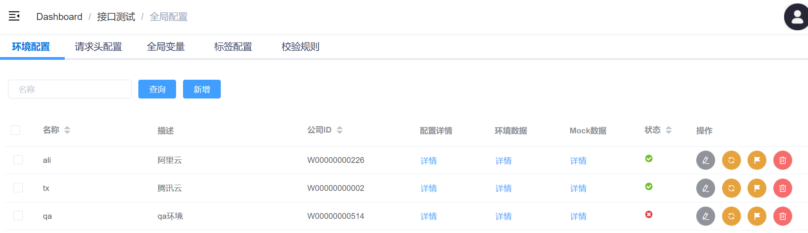
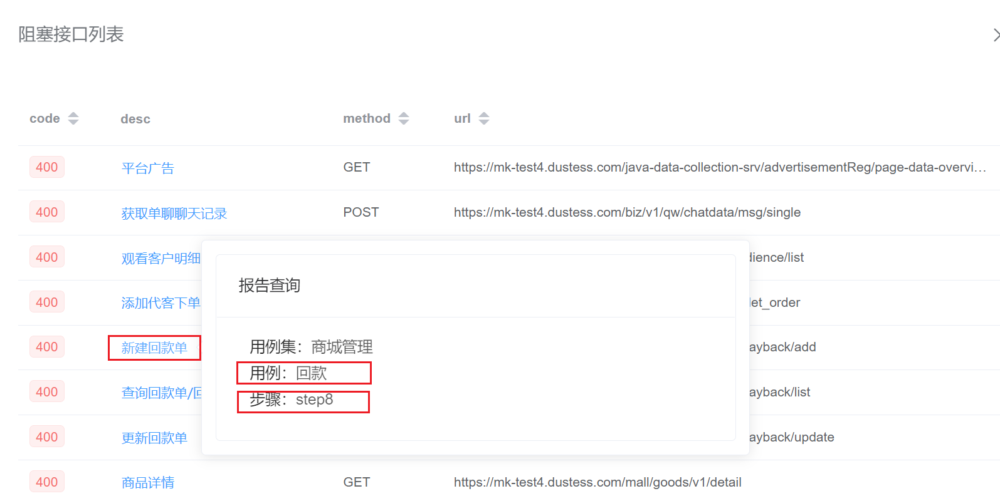

# 环境监控、冒烟、巡检
监控环境可用性状态，并以环境为单位执行冒烟测试、回归测试等。

## 1. 背景

### 1.1 问题
1. 测试环境、QA环境等线下环境阻塞问题多，稳定性差，严重影响测试效率。
2. 测试过程中遇到的部分BUG，无法判断是环境问题还是真实BUG。
3. 暂无有效、快速、自动化的测试环境可用性验证手段。
4. 现有测试用例大多依赖部分环境数据，对变化频繁、无数据的测试环境不友好。

### 1.2 目的
1. 提供对测试环境服务可用性的验证方法，实现快速、自动化验证，并提供可用性验证结果。
2. 解决数据依赖问题。

## 2. 实现方案
基于现有接口测试平台、接口测试用例，通过用例分级设计、分级运行、分级校验的方式，实现快速验证测试环境接口连通性。

### 2.1 用例分级设计
用例类型分为：单接口测试、场景测试、setup、teardown，测试环境可用性验证执行但接口测试用例。
- 单接口测试
  - P0：核心接口正向用例
  - P1：核心接口异常用例
  - P2：非核心接口用例
- 场景测试
- setup
- teardown

### 2.2 测试分级运行
- 测试执行维度
  - 用例集
  - 用例
  - 测试步骤
- 测试用例执行维度
  - 单接口测试
  - 场景测试
- 单接口测试用例执行维度
  - 优先级P0
  - 优先级P1
  - 优先级P2

### 2.3 响应分级校验
- 响应状态码
- 响应json-schema
- 响应值内容

### 2.4. 有变更接口选择性执行
对于存在更新且未对用例进行维护的接口，进行选择性执行：
- 场景测试：遇到有更新待处理的接口请求步骤，停止测试，标记用例失败
- 非场景测试：遇到有更新待处理的接口请求步骤，继续测试，如步骤失败，continue(标记步骤失败并继续后续步骤执行)

### 2.4 测试构建类型
**接口测试->工作台->快速测试/业务巡检/冒烟测试/环境验证**
#### 2.4.1 测试环境可用性验证
通过执行并验证核心接口连通性，确保测试环境基本可用。即：
- 单接口测试用例
- 优先级P0
- 仅校验响应状态码

#### 2.4.2 冒烟测试
- 单接口测试用例
- 优先级P0、P1
- 全部校验：响应状态码、响应值内容
#### 2.4.3 业务巡检
- 全部用例：单接口测试用例、场景用例
- 全部校验：响应状态码、响应值内容
#### 2.4.4 其他（快速测试）
灵活筛选用例执行，指定校验方式。

## 3. 数据依赖处理
现有测试用例大多依赖部分环境数据，对变化频繁、无数据的测试环境不友好，需要构造公共测试依赖数据。
数据构造方式一般2种：
- API构造
- 数据库插入

这里选择API构造的方式。通过管理数据构造API请求集为setup用例，一个setup用例为一组数据构造请求集，供其他测试用例集调用。

调用方式：setup/teardown、setup_class/teardown_class

## 4. 关联模块设计

### 4.1 全局配置
https://qalab.dustess.com/#/api/apiTest/global

#### 4.1.1 环境配置管理
在**接口测试->全局配置->环境配置**处新增、管理测试环境。

### 4.2 工作台
https://qalab.dustess.com/#/api/apiTest/workbench
#### 4.2.1 新增待验证环境
在**接口测试->工作台->环境验证**处新增一条待验证可用性的环境记录，
主要目的为创建一条数据指定需要监控的环境，默认获取并关联最新一条该环境的环境验证测试报告，如果没有显示0（如下）。

#### 4.2.2 执行环境验证测试
点击执行按钮，构建并执行环境可用性验证测试。默认执行方案：
- 单接口测试用例
- 测试步骤标签：优先级P0
- 仅校验响应状态码

#### 4.2.3 查看环境可用性结果

显示最近一次执行结果分析，其中：
- 公司ID：对应环境公司ID
- 上次执行：最近一次执行时间，对应关联的测试报告执行时间
- 通过率
  - 通过/总数
  - 百分比+红/绿颜色展示
  - 通过率==100%，绿色，可用
  - 通过率<100%，红色，不可用
- 结果统计
  - 总数：总测试请求步骤数
  - 通过：响应校验通过
  - 失败：响应校验失败
  - 跳过：跳过未执行
  - 故障：设计错误/代码错误
- 测试报告 
  - pytest：pytest-html生成的报告，内容较简洁，颗粒度为 测试用例。_--仅allure报告生成失败时提供_
  - allure：allure-pytest生成的报告，内容较丰富，颗粒度为 测试步骤，且包含步骤请求、响应、结果校验、变量提取等详细信息。
  - Log：执行当前测试时的全量日志信息。
- 阻塞：故障接口数统计
  - 点击阻塞接口数量，弹窗阻塞接口列表详情
  
  - 点击接口描述，可查看接口所属用例集->用例->步骤
  
  - 点击Allure打开allure报告页面，-> behaviors: 查询用例名称可查到对应步骤的详细执行信息
  

### 4.3 任务管理
记录构建执行中的任务以及历史任务，体现构建执行进度，能查看后端执行日志。(TODO 2022Q2)

## 5. 数据库设计
### 5.1 测试环境监控（TestEnvMonitor）
记录对应测试环境的最新可用性验证构建结果

| 字段名称	| 数据类型	| 长度	| 可空	| 默认值	| 备注  |
|  ----  | ----  | ----  | ----  | ----  | ----  |
| id	  | 自增		| |         | 	| 主键     |
| env	  | 外键		| | False	| 	| 关联环境  |
| report  | 外键		| | True	| 	| 关联测试报告  |
| creator | 外键User | | 	    | 	| 创建者  |

## 6. 接口设计
### 6.1 外部接口
#### 6.1.1 接口说明
| Method	| Path	| Data	| 描述  |
|  ----  | ----  | ----  | ----  |
| GET	| /api_test/test/env_monitor/list	| --	  | 获取记录列表  |
| POST	| /api_test/test/env_monitor/add	| data	  | 新增一条记录  |
| PATCH	| /api_test/test/env_monitor/update	| pk,data | 编辑修改记录  |
| DELETE| /api_test/test/env_monitor/del	| pk	  | 删除一条记录  |

#### 6.1.2 调用方式

